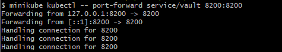
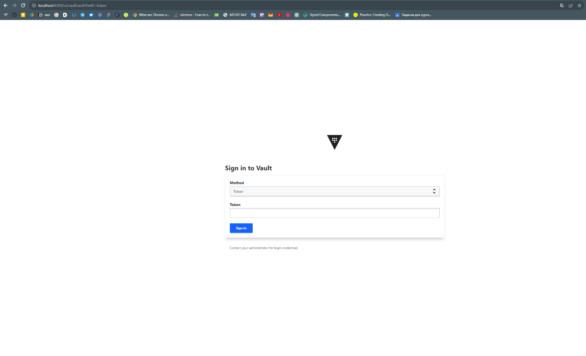

**Лабораторная работа №1**

**\"Установка Docker и Minikube, мой первый манифест.\"**

**Подготовка:**

При установке Minikube на устройстве пользователя требуются включенные
настройки виртуализации. Так как на моем устройстве установлена ОС
Windows 10 Home, у нее в базовом состоянии нет таких настроек. Чтобы их
включить, используем данный скрипт:

***pushd \"%\~dp0\"***

***dir /b %SystemRoot%\\servicing\\Packages\\\*Hyper-V\*.mum
\>hyper-v.txt***

***for /f %%i in (\'findstr /i . hyper-v.txt 2\^\>nul\') do dism /online
/norestart /add-package:\"%SystemRoot%\\servicing\\Packages\\%%i\"***

***del hyper-v.txt***

***Dism /online /enable-feature /featurename:Microsoft-Hyper-V -All
/LimitAccess /ALL***

Pause

После перезагрузки устройства настройки виртуализации успешно
появляются.

При изменении переменных среды, чтобы пользоваться командой minikube, я
также указал переменную MINIKUBE_HOME для того, чтобы папка .minikube
располагалась в нужной мне директориию, сделано это было из-за того, что
на диске С не хватало места

**Выполнение лабораторной:**

{width="6.496527777777778in"
height="2.0229166666666667in"}Запускаем minikube

{width="2.698292869641295in"
height="0.39588910761154855in"}Применяем написанный нами манифест

Создаем сервис

{width="5.250732720909887in"
height="0.3854702537182852in"}

{width="4.948606736657918in"
height="0.9167946194225722in"}Получаем доступ к контейнеру

{width="6.496527777777778in"
height="3.9569444444444444in"}Теперь в браузере заходим на
localhost:8200

Теперь получаем токен для авторизации через команду ***kubectl logs
vault***

Он находится в конце логов, как Root Token

{width="6.0737642169728785in"
height="1.8231714785651794in"}

Авторизовываемся на сайте через полученный токен

{width="6.496527777777778in"
height="4.243055555555555in"}
