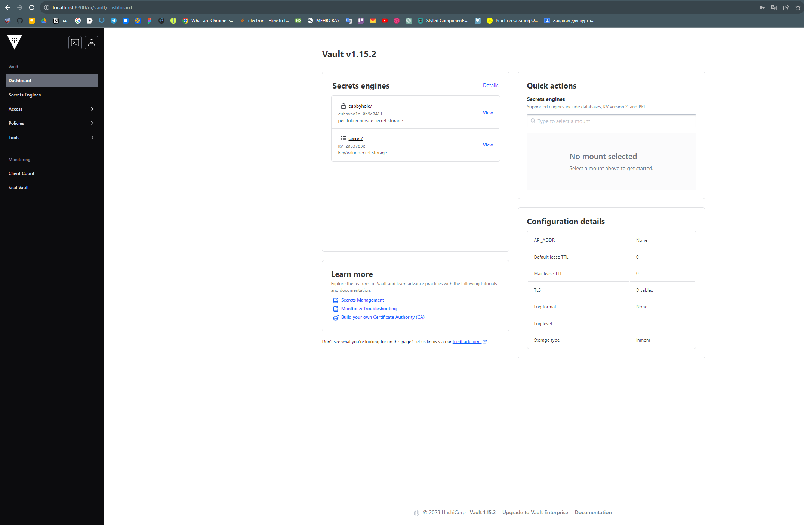
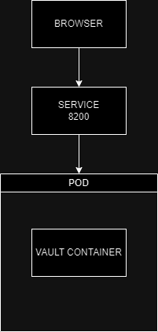

University: [ITMO University](https://itmo.ru/ru/) \
Faculty: [FICT](https://fict.itmo.ru) \
Course: [Introduction to distributed technologies](https://github.com/itmo-ict-faculty/introduction-to-distributed-technologies) \
Year: 2023/2024 \
Group: K4111c \
Author: Demin Vadim Vladimirovich \
Lab: Lab1 \
Date of create: 28.11.2023 \
Date of finished: TBD

**Лабораторная работа №1**

**\"Установка Docker и Minikube, мой первый манифест.\"**

**Подготовка:**

При установке Minikube на устройстве пользователя требуются включенные
настройки виртуализации. Так как на моем устройстве установлена ОС
Windows 10 Home, у нее в базовом состоянии нет таких настроек. Чтобы их
включить, используем данный скрипт:

***pushd \"%\~dp0\"***

***dir /b %SystemRoot%\\servicing\\Packages\\\*Hyper-V\*.mum
\>hyper-v.txt***

***for /f %%i in (\'findstr /i . hyper-v.txt 2\^\>nul\') do dism /online
/norestart /add-package:\"%SystemRoot%\\servicing\\Packages\\%%i\"***

***del hyper-v.txt***

***Dism /online /enable-feature /featurename:Microsoft-Hyper-V -All
/LimitAccess /ALL***

Pause

После перезагрузки устройства настройки виртуализации успешно
появляются.

При изменении переменных среды, чтобы пользоваться командой minikube, я
также указал переменную MINIKUBE_HOME для того, чтобы папка .minikube
располагалась в нужной мне директориию, сделано это было из-за того, что
на диске С не хватало места

**Выполнение лабораторной:**

Запускаем minikube

Применяем написанный нами манифест

Создаем сервис

Получаем доступ к контейнеру

Теперь в браузере заходим на
localhost:8200

Теперь получаем токен для авторизации через команду ***kubectl logs
vault***

Он находится в конце логов, как Root Token

Авторизовываемся на сайте через полученный токен

## Схема

