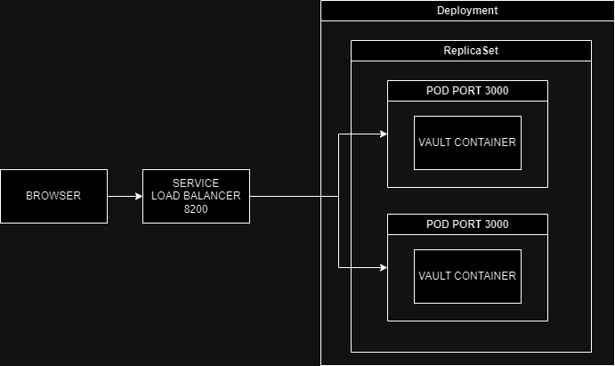

University: [ITMO University](https://itmo.ru/ru/) \
Faculty: [FICT](https://fict.itmo.ru) \
Course: [Introduction to distributed technologies](https://github.com/itmo-ict-faculty/introduction-to-distributed-technologies) \
Year: 2023/2024 \
Group: K4111c \
Author: Demin Vadim Vladimirovich \
Lab: Lab2 \
Date of create: 28.11.2023 \
Date of finished: TBD

**Лабораторная работа №2**

**\"Развертывание веб сервиса в Minikube, доступ к веб интерфейсу
сервиса. Мониторинг сервиса.\"**

Для начала создаем манифест деплоймента на 2 реплики, как требуется в задании. Указываем переменные окружения.

Создаем манифест сервиса для доступа к
нашим подам, в targetPort указываем 3000, т.к. при просмотре image
на dockerhub у контейнера указан порт 3000. Для типа сервиса я
выбрал LoadBalancer для балансировки входящих реквестов

В браузере можно посмотреть на интерфейс двух подов. Переменные на
нем не меняются, возможно потому что я указал их в манифесте
деплоймента

Логи:

## Схема

