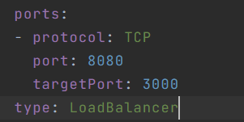

**Лабораторная работа №2**

**\"Развертывание веб сервиса в Minikube, доступ к веб интерфейсу
сервиса. Мониторинг сервиса.\"**

1.  {width="5.209027777777778in"
    height="1.59375in"}Для начала создаем манифест деплоймента на 2
    реплики, как требуется в задании. Указываем переменные окружения.

2.  {width="3.1354166666666665in"
    height="1.5729166666666667in"}Создаем манифест сервиса для доступа к
    нашим подам, в targetPort указываем 3000, т.к. при просмотре image
    на dockerhub у контейнера указан порт 3000. Для типа сервиса я
    выбрал LoadBalancer для балансировки входящих реквестов

3.  В браузере можно посмотреть на интерфейс двух подов. Переменные на
    нем не меняются, возможно потому что я указал их в манифесте
    деплоймента

{width="3.4166666666666665in"
height="1.3506944444444444in"}{width="3.6041666666666665in"
height="1.3298611111111112in"}

4.  {width="6.417361111111111in"
    height="1.40625in"}Логи:
