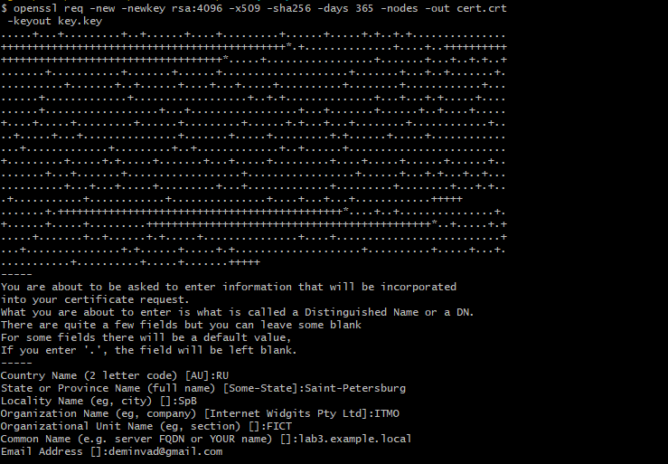
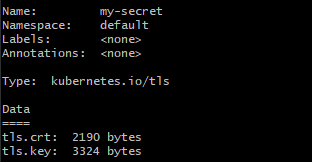
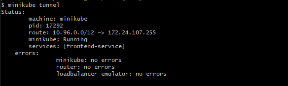
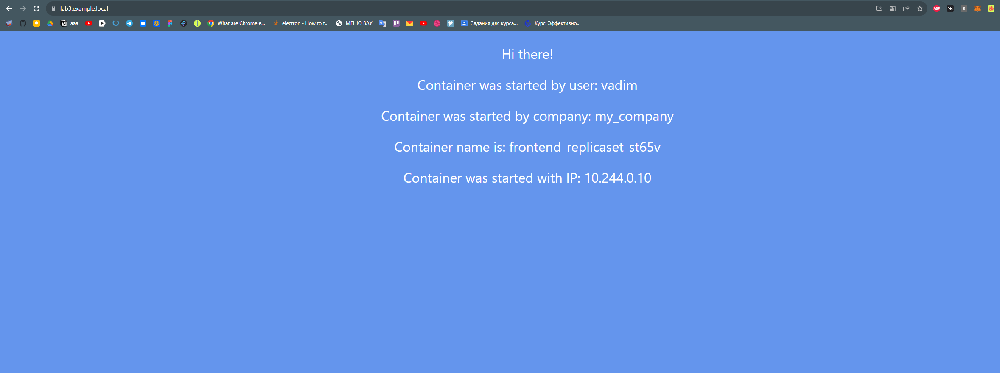
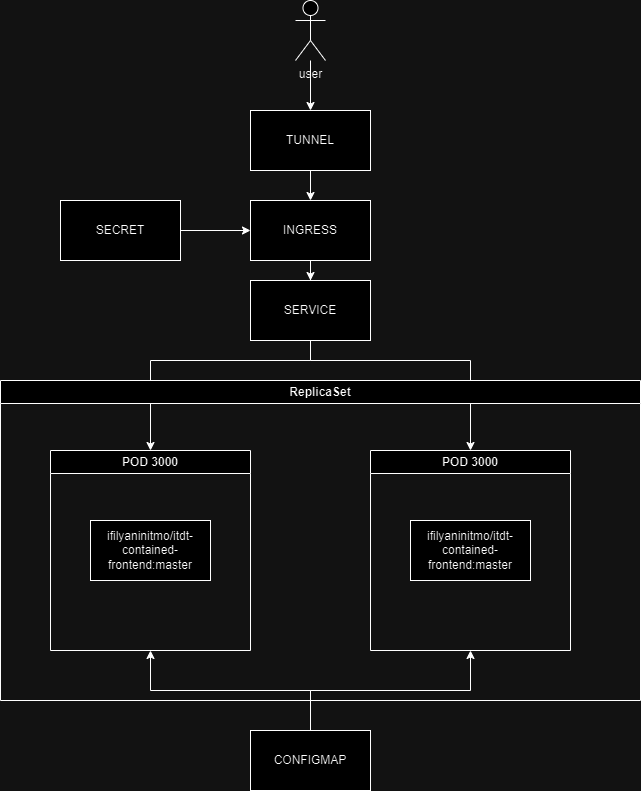

University: [ITMO University](https://itmo.ru/ru/) \
Faculty: [FICT](https://fict.itmo.ru) \
Course: [Introduction to distributed technologies](https://github.com/itmo-ict-faculty/introduction-to-distributed-technologies) \
Year: 2023/2024 \
Group: K4111c \
Author: Demin Vadim Vladimirovich \
Lab: Lab3 \
Date of create: 11.12.2023 \
Date of finished: TBD


## Лабораторная работа №3 "Сертификаты и "секреты" в Minikube, безопасное хранение данных."

Включаем аддон Ingress

```
minikube addons enable ingress
```

Создаем сертификат через openssl:

```
openssl req -new -newkey rsa:4096 -x509 -sha256 -days 365 -nodes -out cert.crt -keyout key.key
```


В параметрах мы указали количество байт в ключе, время действия, и в какие файлы сохранятся данные

Создаем секрет и применяем его:
```
kubectl create secret tls my-secret --key="key.key" --cert="cert.crt"
```



Создаем ReplicaSet, Service, и ConfigMap, применяем их

Теперь узнаем ip minikube и в файлик hosts прописываем его вместе с нашим FDQN
```
minikube ip
```

Теперь запускаем

```
minikube tunnel
```


Смотрим в браузере результат:



# Схема


