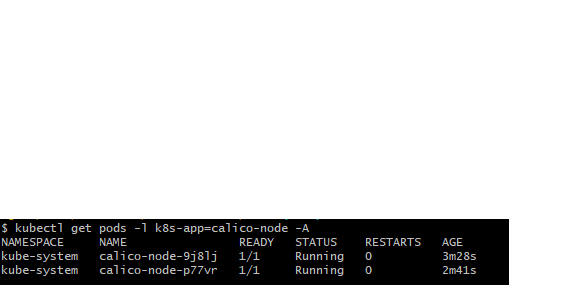
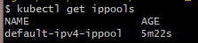
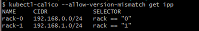
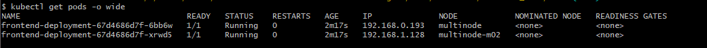
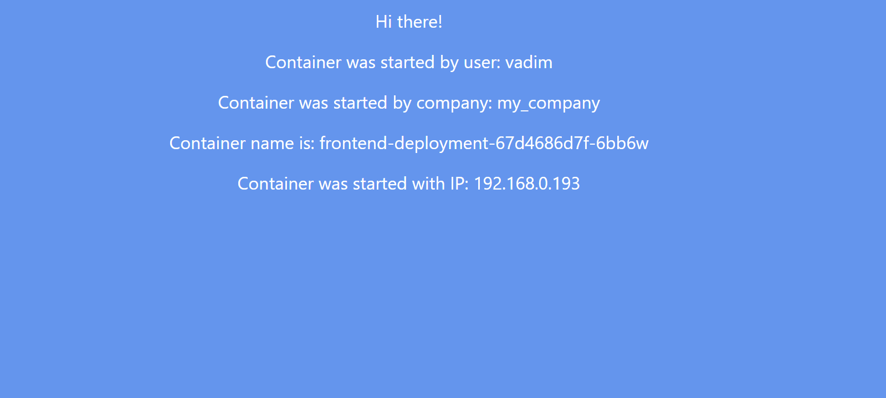
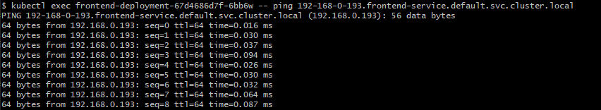
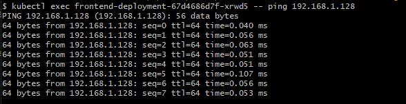
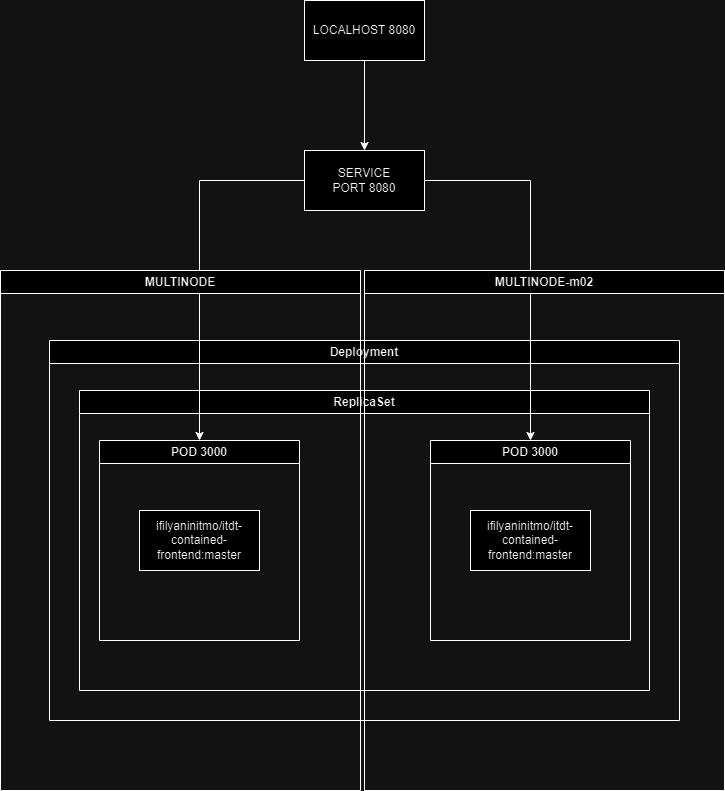

University: [ITMO University](https://itmo.ru/ru/) \
Faculty: [FICT](https://fict.itmo.ru) \
Course: [Introduction to distributed technologies](https://github.com/itmo-ict-faculty/introduction-to-distributed-technologies) \
Year: 2023/2024 \
Group: K4111c \
Author: Demin Vadim Vladimirovich \
Lab: Lab4 \
Date of create: 05.12.2023 \
Date of finished: TBD


## Лабораторная работа №4 "Сети связи в Minikube, CNI и CoreDNS"

При старте minikube запускаем его с параметрами:
 - --network-plugin=cni - говорим Minikube использовать плагин сети Container Network Interface
 - --cni=calico - указываем конкретный плагин Calico
 - --noodes 2 - указываем количество нод
```
minikube start --network-plugin=cni --cni=calico --nodes 2 -p multinode
```

Проверяем ноды:
```
kubectl get pods -l k8s-app=calico-node -A
```


Смотрим дефолтный ippool и удаляем его


```
kubectl delete ippools default-ipv4-ippool
```

Помечаем ноды индексами 0 и 1
```
kubectl label node multinode rack=0
kubectl label node multinode-m02 rack=1
```


После применяем наш написанный манифест для пулов


```
kubectl-calico apply -f ippool.yaml --allow-version-mismatch
```


Далее повторяем работу, проделанную во второй лабораторной работе по созданию деплоймента и сервиса.

Теперь проверяем что у нас создалось 2 пода



Теперь запускаем проброс портов
```
kubectl port-forward service/frontend-service 8080:8080
```

Полученый результат в браузере:



Пингуем первый под, получаем его адрес
```
kubectl exec frontend-deployment-67d4686d7f-6bb6w -- nslookup 192.168.0.193
```



```
kubectl exec frontend-deployment-67d4686d7f-6bb6w -- ping 192-168-0-193.frontend-service.default.svc.cluster.local
```

Пингуем второй под:
```
kubectl exec frontend-deployment-67d4686d7f-xrwd5 -- ping 192.168.1.128
```


## Схема

